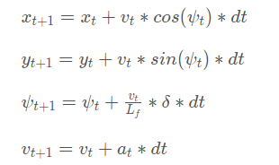

# CarND-Controls-MPC
Self-Driving Car Engineer Nanodegree Program

---

## Dependencies

* cmake >= 3.5
 * All OSes: [click here for installation instructions](https://cmake.org/install/)
* make >= 4.1
  * Linux: make is installed by default on most Linux distros
  * Mac: [install Xcode command line tools to get make](https://developer.apple.com/xcode/features/)
  * Windows: [Click here for installation instructions](http://gnuwin32.sourceforge.net/packages/make.htm)
* gcc/g++ >= 5.4
  * Linux: gcc / g++ is installed by default on most Linux distros
  * Mac: same deal as make - [install Xcode command line tools]((https://developer.apple.com/xcode/features/)
  * Windows: recommend using [MinGW](http://www.mingw.org/)
* [uWebSockets](https://github.com/uWebSockets/uWebSockets)
  * Run either `install-mac.sh` or `install-ubuntu.sh`.
  * If you install from source, checkout to commit `e94b6e1`, i.e.
    ```
    git clone https://github.com/uWebSockets/uWebSockets 
    cd uWebSockets
    git checkout e94b6e1
    ```
    Some function signatures have changed in v0.14.x. See [this PR](https://github.com/udacity/CarND-MPC-Project/pull/3) for more details.
* Fortran Compiler
  * Mac: `brew install gcc` (might not be required)
  * Linux: `sudo apt-get install gfortran`. Additionall you have also have to install gcc and g++, `sudo apt-get install gcc g++`. Look in [this Dockerfile](https://github.com/udacity/CarND-MPC-Quizzes/blob/master/Dockerfile) for more info.
* [Ipopt](https://projects.coin-or.org/Ipopt)
  * Mac: `brew install ipopt`
  * Linux
    * You will need a version of Ipopt 3.12.1 or higher. The version available through `apt-get` is 3.11.x. If you can get that version to work great but if not there's a script `install_ipopt.sh` that will install Ipopt. You just need to download the source from the Ipopt [releases page](https://www.coin-or.org/download/source/Ipopt/) or the [Github releases](https://github.com/coin-or/Ipopt/releases) page.
    * Then call `install_ipopt.sh` with the source directory as the first argument, ex: `bash install_ipopt.sh Ipopt-3.12.1`. 
  * Windows: TODO. If you can use the Linux subsystem and follow the Linux instructions.
* [CppAD](https://www.coin-or.org/CppAD/)
  * Mac: `brew install cppad`
  * Linux `sudo apt-get install cppad` or equivalent.
  * Windows: TODO. If you can use the Linux subsystem and follow the Linux instructions.
* [Eigen](http://eigen.tuxfamily.org/index.php?title=Main_Page). This is already part of the repo so you shouldn't have to worry about it.
* Simulator. You can download these from the [releases tab](https://github.com/udacity/self-driving-car-sim/releases).
* Not a dependency but read the [DATA.md](./DATA.md) for a description of the data sent back from the simulator.


## Basic Build Instructions


1. Clone this repo.
2. Make a build directory: `mkdir build && cd build`
3. Compile: `cmake .. && make`
4. Run it: `./mpc`.

## Write up

* The waypoints of a path array, as well as position, velocity and angle are 
  communicated with the program using uWebSockets. Initially, the received
  coordinates are rotated such that the position across the road is y, as a function
  of x.
* The equations of motion for the car are shown below, with the consideration of
  angle Lf as the transformation angle converting the static body of the car to a point
  centred on the origin of the state coordinates:

* The delay of 0.1s is then calculated based on the kinematic equations of motion
  and the new state is used to find the best fit for a polynomial of third order, 
  while minimising our cost function.
* The cost function is optimised to take into account the values of most importance
  and allow intuitive correction to the mathematical mismatches between
  the model and the simulator. For example, one can drive the solution away from 
  one of the oscillatory and large variations in the actuator angle and throttle, 
  in order to encourage a smoother and more stable driving trajectory.
* When considering the cost function, it is also important to take into account, 
  the predicted state may well go outside the bound of the given
  waypoint coordinates. The number of points in the predicted space is given by
  N, set here as 10, and the separation between them dt, set here as 0.1s. Therefore
  when driving at speeds above 100m/s, our predicted state will extend far beyond the 
  given waypoints which are usually in a range of 40m), and may well start to fit 
  inadequately to the given data.
* The waypoints and predicted points are plotted in the simulator to assist optimising
  these constants, costs and allow for a better accuracy.
  
Find below the videos showing the running simulator with this code:
https://drive.google.com/open?id=0B8oLHWPlmk8iUFI2S1h1dWJGU1U
https://drive.google.com/open?id=0B8oLHWPlmk8iVTd4el9BWHZsM2M